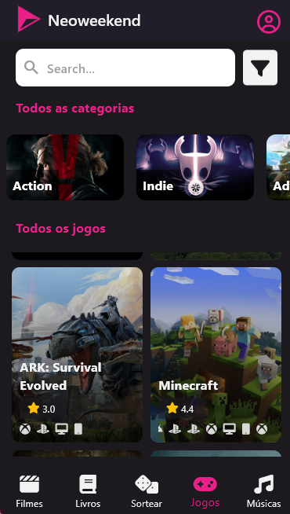
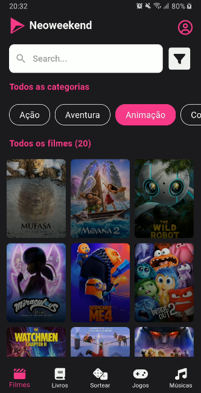
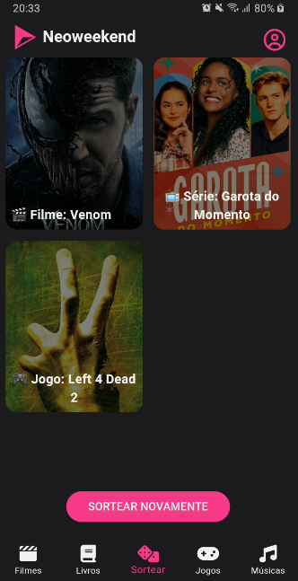

## NeoWeekend: Aplicativo de Sugestões para o Fim de Semana


<br/>

NeoWeekend é um aplicativo desenvolvido para ajudar você a aproveitar seu fim de semana com sugestões de filmes, séries, jogos, livros e músicas. O app conta com uma API para fornecer conteúdo e uma página de sorteio onde um item de cada categoria é selecionado aleatoriamente para você curtir.

## Imagens

<div style="display: flex; justify-content: center; flex-wrap: wrap; width: 100%">
  
  
  
   
   
</div>

## Funcionalidades
### Filmes:
Exibe filmes populares com base nas últimas tendências.
### Séries:
Sugestões de séries para maratonar.
### Jogos:
Recomendações de jogos para diversas plataformas e gêneros.
### Livros:
Pesquisa de livros com base em termos definidos.
### Músicas:
Sugestões de músicas e álbuns para você curtir no seu tempo livre.
### Sorteio Aleatório:
Página dedicada ao sorteio de um item de cada categoria para você decidir o que fazer no fim de semana.

## Tecnologias Utilizadas

<div style="display: flex; justify-content: center ; width: 100%">
   
  
</div>

## Endpoints da API
### API de Filmes (The Movie Database - TMDB)
- A API de filmes oferece acesso aos filmes mais populares e possibilita pesquisas.

Endpoint: 
```
https://api.themoviedb.org/3/movie/popular?api_key=${API_MOVIE_KEY}&page=1
```

Parâmetros:
- api_key: Sua chave de API.
- page: Número da página de resultados (padrão é 1).

Imagem:
```
https://image.tmdb.org/t/p/w500/{caminho_da_imagem}
```

### API de Séries (The Movie Database - TMDB)

Exibe séries populares e permite filtro por idioma, sendo possível buscar séries em português.

Endpoint:
```
https://api.themoviedb.org/3/discover/tv?api_key=${API_MOVIE_KEY}&page=1
```

Parâmetros:
- api_key: Sua chave de API.
- original_language: Para buscar séries em português, utilize o valor pt.

Imagem:
```
https://image.tmdb.org/t/p/w500/{caminho_da_imagem}
```

### API de Jogos (RAWG - Game API)

A API de jogos oferece acesso aos jogos mais populares, com filtros de pesquisa por categoria e plataforma.

Endpoint:
```
https://api.rawg.io/api/games?key=${API_GAME_KEY}&page=1
```

Parâmetros:
- key: Sua chave de API.
- Search: Termo de pesquisa para filtrar os jogos.
- Genres: Gênero do jogo.
- page: Número da página de resultados (padrão é 1).

Imagem:
```
https://rawg.io/media/slider_genres/{caminho_da_imagem}
```

### API de Livros (Open Library)

A API de livros permite buscar livros por título ou autor.

Endpoint:
```
https://openlibrary.org/search.json?q=livro&start=0&limit=100
```

Parâmetros:
- q: Termo de pesquisa.
- start: Índice inicial dos resultados.
- limit: Limite de resultados (padrão é 100).

Imagem:
```
https://covers.openlibrary.org/b/id/{cover_i}-L.jpg
```

### API de Músicas (Deezer API)

A API do Deezer fornece acesso a músicas, álbuns e artistas para você explorar.

Endpoint:
```
https://api.deezer.com/search?q={termo_de_pesquisa}
```

Parâmetros:
- q: Termo de pesquisa (pode ser o nome da música, álbum ou artista).

Imagem:
```
https://e-cdns-images.dzcdn.net/images/cover/{caminho_da_imagem}-L.jpg
```

## Instruções de Uso

- Crie uma conta nas plataformas de API listadas (TMDB, RAWG, Open Library, Deezer).
- Obtenha suas chaves de API.
- Substitua as variáveis de chave de API no código com as suas chaves pessoais.
- Use os endpoints fornecidos para integrar os dados ao seu aplicativo NeoWeekend.
- Aproveite as sugestões e o sorteio aleatório para planejar seu fim de semana.

## Configuração

### Instalar Dependências: Instale as dependências do projeto com o comando:
```
flutter pub get
```

### Configurar as Chaves de API: No código, insira suas chaves de API nas variáveis correspondentes.

Executar o App: Para rodar o aplicativo no emulador ou dispositivo, utilize o comando:
```
flutter run
```

## Contribuições

Contribuições são bem-vindas! Sinta-se à vontade para abrir issues ou enviar pull requests para melhorias e novas funcionalidades.

## Licença

Este projeto é licenciado sob a [MIT License](LICENSE).

## Contato

Se tiver dúvidas ou sugestões, sinta-se à vontade para entrar em contato através de:

- **Email**: [liedson.b9@gmail.com](mailto:liedson.b9@gmail.com)
- **LinkedIn**: [liedsonlb](https://linkedin.com/in/liedsonlb)
- **Instagram**: [liedson.vue](https://www.instagram.com/liedson.vue)
- **Github**: [LiedsonLB](https://github.com/LiedsonLB)
- **Portfólio**: [Liedson Barros](https://liedsonbarros.vercel.app)

## Releases

- Release v1.0✅ - [Release v1.0.0](https://github.com/LiedsonLB/neoweekend/releases/tag/v1.0.0)